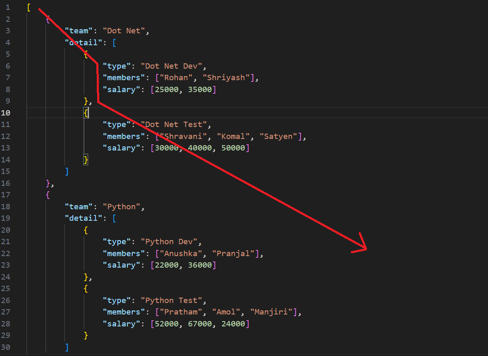

# FlatData Python Library

## Overview
The library provides a seamless solution for converting unstructured data into structured format, making data easier to process, analyze, and store. By organizing nested or inconsistent data into a standardized format, this tool simplifies data handling for various applications.

## Use Cases
- **Data Processing:** Clean and structure raw JSON or dictionaries for easier analysis.
- **Machine Learning:** Prepare datasets for feature extraction and model training.
- **API Integration:** Structure API responses into consistent formats for frontend or backend use.
- **Database Operations:** Normalize data for storage in relational or NoSQL databases.
- **Scientific Research:** Organize experimental or biological data for statistical studies.
- **Business Applications:** Format data for reports, dashboards, or CRM systems.

## How to use it?

Install to library use the following command.
```pip install flat-data```

Import the library
```from flat_data import FlatData```

Pass the data that you want to structure and the records which you want to include.

```python
from flat_data import FlatData

input_data = [
    {
        "team": "Dot Net",
        "detail": [
            {
                "type": "Dot Net Dev",
                "members": ["Rohan", "Shriyash"],
                "salary": [25000, 35000]
            },
            {
                "type": "Dot Net Test",
                "members": ["Shravani", "Komal", "Satyen"],
                "salary": [30000, 40000, 50000]
            }
        ]
    },
    {
        "team": "Python",
        "detail": [
            {
                "type": "Python Dev",
                "members": ["Anushka", "Pranjal"],
                "salary": [22000, 36000]
            },
            {
                "type": "Python Test",
                "members": ["Pratham", "Amol", "Manjiri"],
                "salary": [52000, 67000, 24000]
            }
        ]
    }
]

fd = FlatData(data=input_data, records=['team', 'type', 'members', 'salary'])

flatten_data = fd.get_flat_data()
```

Recommended sequence for the records list is from top left to bottom right. In the below example, ```['team', 'type', 'members', 'salary']```

